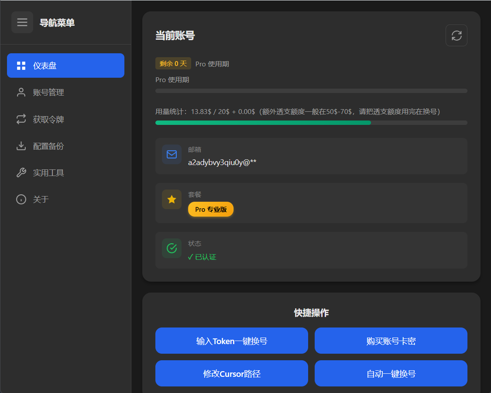

# Cursor-Shifter（Cursor 一键续杯换号助手）

**Cursor 一键续杯换号助手**

轻松一键续杯 Cursor Pro，支持使用 20 美元 Pro 会员账号 和 10 美元试用会员账号

**支持 Claude 4.5 及 MAX、GPT 5 等会员模型**

[GitHub 仓库](https://github.com/Sxuan-Coder/cursor-shifter) | [问题反馈](https://github.com/Sxuan-Coder/cursor-shifter/issues) | [下载软件](https://github.com/Sxuan-Coder/cursor-shifter/releases)

## 

## ✨ 功能特性

### 🎯 核心功能

- **📊 仪表盘**

  - 实时显示当前 Cursor 账号信息
  - 智能识别账号类型
  - 动态显示试用期/使用期剩余天数
  - 可视化用量统计
  - 邮箱隐私保护

- **🔄 账号管理**

  - 一键换号（手动输入 Token）
  - 自动换号（自动获取 Token）
  - 账号列表管理（添加/删除/切换）
  - 批量导入/导出账号（支持 JSON 格式）

- **🎫 获取令牌**

  - 智能提取 AccessToken
  - 自动保存到账号列表

- **💾 配置备份**

  - 一键备份当前 Cursor 配置
  - 支持创建/恢复/删除备份
  - 换号前自动备份
  - 备份文件信息展示

- **🔧 实用工具**

  - 禁用 HTTP/2 协议
  - 设置代理端口（支持自定义端口）

### 🎨 界面特性

- **现代化 UI 设计**

  - 深色主题，护眼舒适
  - 响应式布局，适配多种屏幕尺寸
  - 流畅的动画效果
  - 直观的图标和视觉反馈

- **用户体验优化**
  - 清晰的步骤引导
  - 友好的错误提示
  - 操作确认对话框
  - 实时状态显示

---

## 软件图片

  

---

## 🚀 快速开始

### 方式一：下载安装包（推荐）

1. 访问 [Releases 页面](https://github.com/Sxuan-Coder/cursor-shifter/releases)
2. 下载最新版本的安装包
   - Windows: `Cursor-Shifter-x.x.x-setup.exe`
   - Mac: `Cursor-Shifter-x.x.x.dmg`
3. 运行安装程序
4. 启动应用

## 🎮 使用指南

[【使用前必看】软件使用教程文档](https://docs.qq.com/aio/DT0p2dU9jb3NUSnhH)

---

## ❓ 常见问题

### Q1: 换号后 Cursor 无法启动？

**A**: 尝试以下步骤：

1. 进入"配置备份"页面
2. 选择最近的备份
3. 点击"恢复"
4. 如果问题依然存在，手动删除 Cursor 配置文件后重装

### Q2: 提示"Cursor 数据库不存在"？

**A**: 确保：

1. Cursor 已正确安装
2. 至少登录过一次 Cursor
3. Cursor 完全关闭（检查任务管理器）

### Q3: 自动换号提示"已过期"？

**A**:

1. 检查激活码是否在有效期内

### Q4: 用量统计显示不准确？

**A**:

1. 点击仪表盘的"刷新"按钮
2. 确保 Cursor 已登录
3. 检查网络连接是否正常

---

## QQ 反馈群

  

---

## 🔄 更新日志

### 最新版本号
 v0.3.2
---

## ⚠️ 声明

### 使用声明

1. 本项目仅供**学习交流**使用，请勿用于商业用途
2. 使用本项目造成的任何后果，由使用者自行承担
3. 本项目不承担任何法律责任

## 📮 联系方式

### 作者信息

- **作者**: 上玄
- **项目地址**: [cursor-shifter](https://github.com/Sxuan-Coder/cursor-shifter)

---

## 🌟 Star History

如果这个项目对您有帮助，请给个 Star ⭐️

---

**如果觉得这个项目有用，别忘了给个 Star ⭐️**

